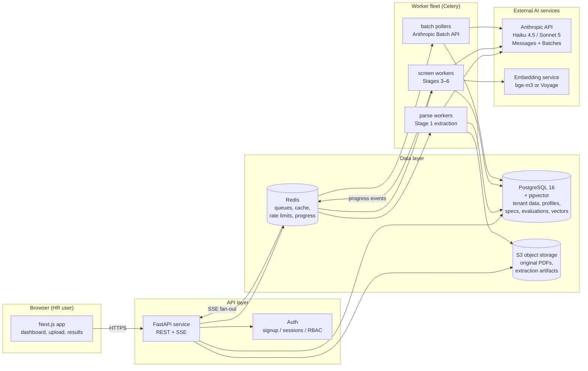

# 01 — System Overview

sentHire is a **multi-tenant SaaS**: HR users sign up on the website, create an
organization workspace, and run every workflow in the browser. There is nothing to
install. This document describes the high-level architecture, the services, the API
surface, tenancy, and deployment.

## 1. High-level architecture



### Components

| Component | Responsibility | Technology |
|---|---|---|
| **Web app** | Job creation, template editing, NL requirement input, CV upload, live progress, ranked results, evidence viewer, overrides, comparisons | Next.js/React |
| **API service** | REST API, authn/z, tenancy enforcement, upload handling (presigned S3 URLs), run orchestration, progress polling (SSE planned) | FastAPI (async) |
| **Requirement compiler** | Template + NL instructions → versioned Evaluation Spec (LLM-assisted, HR-confirmed) | Library called by API; Sonnet 5 |
| **Parse workers** | PDF → structured Candidate Profile (Stage 1); dedup by file hash; derived-field computation | Celery queue `parse` |
| **Screen workers** | Deterministic filter, lightweight screening, deep analysis, scoring (Stages 3–6) | Celery queue `screen` |
| **Batch pollers** | Submit/poll Anthropic Message Batches for high-volume runs | Celery beat + queue `poll` |
| **Scoring engine** | Pure, versioned function: (spec, verdicts) → scores, rank, explanations | Plain Python library (no LLM) |
| **PostgreSQL** | All tenant data; JSONB for profiles/specs/evaluations; pgvector for embeddings; audit log | Postgres 16 |
| **Redis** | Celery broker, result cache, per-org rate limiting, progress counters | Redis 7 |
| **Object storage** | Original documents (immutable, content-addressed), extracted text/page images | S3-compatible |

### Why this shape

- **One database.** Profiles, specs, evaluations and vectors all live in Postgres.
  JSONB gives schema flexibility for LLM outputs; pgvector avoids operating a separate
  vector store at this scale (a few thousand vectors per job — trivial). Fewer systems
  = faster MVP, simpler tenancy.
- **Queues everywhere the LLM is.** Every model call happens in a worker, never in an
  API request handler. The API only enqueues and reports progress. This is what makes
  100 → 10,000 CV uploads the *same* architecture (see [doc 08](08-batch-processing-and-caching.md)).
- **The scorer is not a model.** Ranking must be reproducible, instantly re-computable
  when HR edits weights, and auditable. So Stage 6 is deterministic code operating on
  stored LLM verdicts ([doc 06](06-scoring-and-explainability.md)).

## 2. Multi-tenancy (SaaS)

Everything is scoped to an `organization`:

- Every table carries `org_id`; every query is tenant-filtered at the repository layer,
  with **Postgres Row-Level Security as a second enforcement layer** (`SET app.org_id`
  per request; policies `USING (org_id = current_setting('app.org_id')::uuid)`).
- S3 keys are prefixed `org/{org_id}/...`; presigned URLs are minted per request.
- Redis keys, rate limits and token budgets are per-org — one tenant's 5,000-CV upload
  cannot starve another tenant ([doc 08 §1](08-batch-processing-and-caching.md)).
- Candidate identity and profile caching are **org-scoped**: the "same candidate
  applied to 5 jobs → parse once" optimization never crosses tenant boundaries.
- Self-serve signup: company + admin account in one step → invite teammates by
  email. Shipped roles are `admin` (billing, team, settings) and `member`
  (everything else); finer-grained roles (e.g. read-only viewer) and SSO
  (SAML/OIDC) are post-MVP enterprise features.
- Deletion is tenant-complete: dropping an org cascades DB rows, vectors, S3 objects,
  and queued work ([doc 09](09-fairness-and-compliance.md) for KVKK/GDPR erasure).

## 3. API surface (backend architecture example)

All endpoints are under `/api/v1`, JSON, org-scoped by the authenticated session
(HttpOnly cookie; only a SHA-256 of the token is stored server-side).

```text
# Auth & workspace
POST   /auth/signup                        → create org + admin, start session
POST   /auth/login  /auth/logout           → session lifecycle
GET    /auth/me                            → current user + org
POST   /auth/forgot-password               → enumeration-safe reset email
GET/POST /auth/password-resets/{token}     → single-use reset (60 min TTL)
GET    /org  /org/members                  → workspace info, member list
POST   /org/invitations                    → invite by email (7-day link, admin only)
POST   /org/invitations/{id}/resend        → rotate token; DELETE revokes
GET/POST /auth/invitations/{token}[/accept]→ invitee joins the workspace
PATCH  /org/members/{user_id}              → role / deactivate (last admin protected)

# Billing (CV-volume plans, iyzico)
GET    /billing                            → plan, monthly usage, quota
PUT    /billing/details                    → invoice details
POST   /billing/checkout                   → iyzico subscription checkout form
POST   /billing/cancel                     → cancel at period end

# Jobs & templates
GET    /templates                          → predefined role templates (Sales Specialist, ...)
POST   /jobs                               → create job (title, template_id?, description)
GET    /jobs/{job_id}
PATCH  /jobs/{job_id}

# Requirement compilation (Stage 2)
POST   /jobs/{job_id}/requirements/compile → body: {template_overrides, natural_language_text}
                                             returns DRAFT EvaluationSpec + clarifying questions
POST   /jobs/{job_id}/requirements/confirm → HR confirms/edits draft → frozen spec version N
GET    /jobs/{job_id}/requirements         → current + historical spec versions

# Candidate intake
POST   /jobs/{job_id}/uploads              → returns presigned S3 URLs (bulk, up to 500)
POST   /jobs/{job_id}/uploads/complete     → registers uploaded files, enqueues parsing
GET    /jobs/{job_id}/candidates           → intake status per file (parsed/failed/duplicate)

# Screening runs
POST   /jobs/{job_id}/runs                 → start screening {spec_version, mode: interactive|batch}
GET    /runs/{run_id}                      → status + funnel counters
GET    /runs/{run_id}/events               → SSE stream (planned; today the UI polls
                                             GET /runs/{run_id}, which is cheap)
POST   /runs/{run_id}/cancel

# Results & explainability
GET    /runs/{run_id}/results              → ranked list (score, band, pass/fail, flags)
GET    /runs/{run_id}/results/{app_id}     → full breakdown: per-requirement verdicts,
                                             evidence quotes with document spans, confidence,
                                             strengths/weaknesses, missing info
GET    /applications/{app_id}/document     → presigned view of original CV (+highlight anchors)

# Hiring pipeline (after the ranking; doc 10 §9)
GET    /jobs/{job_id}/pipeline             → board: tray of screened candidates + columns
POST   /jobs/{job_id}/pipeline/shortlist   → bulk move tray → shortlisted (idempotent)
PATCH  /applications/{app_id}/stage        → move a card; appends a pipeline event
PATCH  /applications/{app_id}              → owner, next action (+due date)
POST   /applications/{app_id}/events       → note | contact | meeting | outcome
GET    /applications/{app_id}/timeline     → the candidate's full event history
GET    /pipeline/agenda                    → org-wide upcoming/overdue next actions

# Human control
POST   /runs/{run_id}/results/{app_id}/override   → {decision, reason}  (audited)
POST   /jobs/{job_id}/rerun                       → re-screen with new spec version
                                                    (reuses profiles; see doc 08 §4 memoization)
GET    /jobs/{job_id}/compare?apps=a,b,c          → side-by-side matrix

# Governance
GET    /audit?job_id=...                   → immutable audit trail (spec changes, runs,
                                             model/prompt versions, overrides, exports)
DELETE /candidates/{candidate_id}          → GDPR/KVKK erasure (cascades everywhere)
```

Example — `GET /runs/{run_id}/results` (truncated):

```json
{
  "run_id": "run_9f2c",
  "spec_version": 3,
  "funnel": {"uploaded": 100, "parsed": 98, "hard_filter_passed": 72,
             "light_screened": 72, "deep_analyzed": 15, "ranked": 72},
  "results": [
    {
      "application_id": "app_042",
      "rank": 1,
      "overall_score": 86,
      "band": "top",
      "hard_requirements": "pass",
      "confidence": "high",
      "flags": [],
      "headline": {
        "strengths": ["5y B2B sales", "SaaS industry 3y", "English C1"],
        "weaknesses": ["Lives in Istanbul (Ankara preferred)"]
      }
    }
  ]
}
```

## 4. Request lifecycle (what happens when HR clicks *Start screening*)

1. API validates the job has a **confirmed** spec version and ≥1 parsed profile.
2. Creates `screening_run` row (`status=queued`, funnel counters zeroed).
3. Enqueues one `screen.application` task per application **that lacks a memoized
   evaluation** for (profile_version, spec_version, pipeline_version); already-evaluated
   pairs are copied forward instantly (re-run cheapness comes from here).
4. Workers execute Stages 3→6 per candidate; every state transition updates the
   run's funnel counters; the UI polls `GET /runs/{id}` (SSE is a planned upgrade,
   the polling contract stays).
5. When all applications reach a terminal state, the run flips to `complete`; ranking
   is computed by the deterministic scorer and stored.

Modes:
- **interactive** — direct Messages API calls, parallelism capped by org budget; a
  100-CV run finishes in ~3–5 minutes.
- **batch** — Anthropic Message Batches (50% cheaper); pollers collect results; typical
  completion well under 1 hour. Default for >200 CVs or when the user chooses
  "economy" ([doc 07](07-model-strategy-and-cost.md)).

## 5. Environments & deployment

| Stage | Setup |
|---|---|
| MVP | Single region. Docker Compose → one API container, one worker container (all queues), Postgres, Redis, S3. CI deploys to a small ECS/Fly/Render footprint. |
| Growth | API and workers as separate autoscaled services; queue-depth-based worker scaling; managed Postgres with read replica; CDN for the app. |
| Scale | See [doc 11](11-mvp-and-scaling.md): per-queue worker pools, KEDA autoscaling, partitioned tables, dedicated extraction fleet, multi-region data residency (KVKK: Türkiye/EU hosting option). |

Secrets (Anthropic API key, DB creds) live in the platform secret manager; the browser
never talks to the LLM provider directly — all model traffic goes through workers where
it is metered per org ([doc 07 §6](07-model-strategy-and-cost.md)).

## 6. Observability

- **Token metering**: every model call records `{org, job, run, stage, model,
  input_tokens, output_tokens, cache_read, cache_write, cost}` — the raw material for
  the cost dashboards and per-org budgets.
- **Tracing**: OpenTelemetry spans per application per stage; a slow run is diagnosable
  to the exact stage and model call.
- **Quality metrics**: parse success rate, JSON-schema retry rate, stage-4 vs stage-5
  verdict agreement (drift detector), human-override rate per requirement (mis-spec
  detector).
