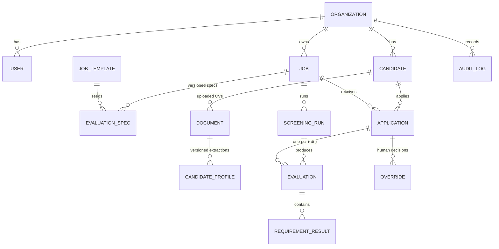

# 03 — Data Model: Database Schema, Candidate Profile, Evaluation Spec

Three modeling rules drive everything here:

1. **Relational skeleton, JSONB flesh.** Identities, relationships, state machines and
   audit are relational; LLM-produced documents (profiles, specs, verdicts) are
   validated JSONB with explicit `*_version` columns.
2. **Content-addressed documents.** Files are keyed by hash; parsing results attach to
   the document, not the application ⇒ "same CV, five jobs, one parse".
3. **Everything an evaluation depended on is stamped on it.** `(profile_version,
   spec_version, pipeline_version, model_id, prompt_version)` — this makes memoization,
   reproducibility and audit trivial.

## 1. Entity overview



## 2. Core tables (PostgreSQL DDL, abridged)

```sql
create table organizations (
  id uuid primary key default gen_random_uuid(),
  name text not null,
  region text not null default 'eu',          -- data residency (KVKK/GDPR)
  settings jsonb not null default '{}',       -- weights defaults, redaction mode, budgets
  created_at timestamptz not null default now()
);

create table users (
  id uuid primary key default gen_random_uuid(),
  org_id uuid not null references organizations(id),
  email citext not null unique,
  role text not null check (role in ('owner','recruiter','viewer')),
  created_at timestamptz not null default now()
);

create table job_templates (              -- curated library: "Sales Specialist", ...
  id uuid primary key,
  slug text unique not null,
  locale text not null default 'tr',
  title text not null,
  spec_seed jsonb not null                -- pre-built requirement list (EvaluationSpec shape)
);

create table jobs (
  id uuid primary key default gen_random_uuid(),
  org_id uuid not null references organizations(id),
  title text not null,
  template_id uuid references job_templates(id),
  status text not null default 'draft' check (status in ('draft','open','closed','archived')),
  created_by uuid references users(id),
  created_at timestamptz not null default now()
);

create table evaluation_specs (           -- immutable versions; edits create a new row
  id uuid primary key default gen_random_uuid(),
  org_id uuid not null,
  job_id uuid not null references jobs(id),
  version int not null,
  status text not null check (status in ('draft','confirmed','superseded')),
  spec jsonb not null,                    -- EvaluationSpec document (§4)
  source_nl_text text,                    -- HR's original natural language, verbatim
  compiler_model text, compiler_prompt_version text,
  confirmed_by uuid references users(id), confirmed_at timestamptz,
  created_at timestamptz not null default now(),
  unique (job_id, version)
);

create table candidates (
  id uuid primary key default gen_random_uuid(),
  org_id uuid not null,
  primary_email citext, primary_phone text,
  display_name text,                      -- for lists; PII fields encrypted at rest
  identity_keys jsonb not null default '[]',  -- resolution keys (hashed email/phone)
  created_at timestamptz not null default now(),
  erased_at timestamptz                   -- GDPR/KVKK tombstone
);

create table documents (
  id uuid primary key default gen_random_uuid(),
  org_id uuid not null,
  candidate_id uuid references candidates(id),
  sha256 text not null,
  s3_key text not null,
  mime text not null, page_count int, size_bytes bigint,
  document_kind text default 'cv',        -- cv | cover_letter | other (from Stage 1)
  parse_status text not null default 'pending'
      check (parse_status in ('pending','parsing','parsed','failed','unsupported')),
  parse_error jsonb,
  created_at timestamptz not null default now(),
  unique (org_id, sha256)                 -- the dedup key
);

create table candidate_profiles (         -- versioned: re-extraction => new version
  id uuid primary key default gen_random_uuid(),
  org_id uuid not null,
  document_id uuid not null references documents(id),
  candidate_id uuid not null references candidates(id),
  version int not null,
  profile jsonb not null,                 -- CandidateProfile document (§3)
  raw_text text not null,                 -- linearized extraction, for Stage 5 + viewer
  extraction_confidence real,
  extractor_model text, extractor_prompt_version text, pipeline_version text,
  created_at timestamptz not null default now(),
  unique (document_id, version)
);

create table applications (               -- candidate ⇄ job
  id uuid primary key default gen_random_uuid(),
  org_id uuid not null,
  job_id uuid not null references jobs(id),
  candidate_id uuid not null references candidates(id),
  document_id uuid not null references documents(id),
  status text not null default 'received'
      check (status in ('received','profiled','screened','shortlisted','rejected','withdrawn')),
  created_at timestamptz not null default now(),
  unique (job_id, candidate_id)
);

create table screening_runs (
  id uuid primary key default gen_random_uuid(),
  org_id uuid not null, job_id uuid not null references jobs(id),
  spec_id uuid not null references evaluation_specs(id),
  mode text not null check (mode in ('interactive','batch')),
  status text not null default 'queued'
      check (status in ('queued','running','complete','failed','cancelled')),
  funnel jsonb not null default '{}',     -- live counters per stage
  cost jsonb not null default '{}',       -- token & $ metering per stage/model
  started_at timestamptz, finished_at timestamptz
);

create table evaluations (                -- one per (application, run); memoization unit
  id uuid primary key default gen_random_uuid(),
  org_id uuid not null,
  run_id uuid not null references screening_runs(id),
  application_id uuid not null references applications(id),
  profile_version int not null, spec_version int not null, pipeline_version text not null,
  stage_reached text not null,            -- hard_filter | light | deep
  hard_result text not null check (hard_result in ('pass','fail','borderline')),
  overall_score real, rank int, band text, confidence real,
  result jsonb not null,                  -- full explanation object (doc 06)
  models_used jsonb not null,             -- {"light":"claude-haiku-4-5", "deep":"claude-sonnet-5", ...}
  created_at timestamptz not null default now(),
  unique (run_id, application_id)
);

create table requirement_results (        -- normalized for analytics; also embedded in result jsonb
  id bigint generated always as identity primary key,
  evaluation_id uuid not null references evaluations(id),
  req_id text not null,
  verdict text not null check (verdict in ('met','partially_met','not_met','unknown','disqualified')),
  score real, confidence real,
  info_status text check (info_status in ('explicit','inferred','ambiguous','missing')),
  evidence jsonb,                         -- [{quote, page, span}]
  source_stage text                       -- deterministic | light | deep
);

create table embeddings (
  id bigint generated always as identity primary key,
  org_id uuid not null,
  scope text not null,                    -- 'profile' | 'experience' | 'requirement' | 'title'
  ref_id uuid not null,                   -- profile id / spec id / ...
  chunk_key text not null,                -- e.g. 'experience:2'
  model text not null,
  vector vector(1024) not null,
  unique (scope, ref_id, chunk_key, model)
);
create index on embeddings using hnsw (vector vector_cosine_ops);

create table overrides (
  id uuid primary key default gen_random_uuid(),
  org_id uuid not null,
  application_id uuid not null references applications(id),
  run_id uuid references screening_runs(id),
  user_id uuid not null references users(id),
  action text not null,                   -- 'promote' | 'reject' | 'restore' | 'note'
  reason text,
  created_at timestamptz not null default now()
);

create table audit_log (                  -- append-only; no updates/deletes
  id bigint generated always as identity primary key,
  org_id uuid not null,
  actor uuid,                             -- null = system
  event text not null,                    -- spec.confirmed, run.started, override.created, export.created, candidate.erased ...
  entity jsonb not null,                  -- {type, id}
  detail jsonb not null default '{}',
  at timestamptz not null default now()
);
```

Row-Level Security is enabled on every org-scoped table (see doc 01 §2). Hot-path
indexes: `applications(job_id, status)`, `evaluations(run_id, rank)`,
`documents(org_id, sha256)`, GIN on `candidate_profiles(profile jsonb_path_ops)` for
deterministic-filter queries.

## 3. CandidateProfile JSON schema (the normalized candidate)

Validated with JSON Schema on write (extraction uses the same schema as the model's
structured-output format). Abridged but representative:

```jsonc
{
  "schema_version": "1.2",
  "document_kind": "cv",
  "language": "tr",                        // detected source language(s)
  "identity": {                            // minimized; PII-classified fields
    "full_name": "…",
    "emails": ["…"], "phones": ["…"],
    "links": [{"type": "linkedin", "url": "…"}]
  },
  "location": {
    "raw": "Çankaya/Ankara",
    "city_canonical": "Ankara", "country": "TR",
    "relocation_signal": {"value": null, "info_status": "missing"}
  },
  "experience": [
    {
      "title_raw": "Kıdemli Satış Uzmanı",
      "title_canonical": "senior_sales_specialist",   // taxonomy id, doc 05
      "company": "Acme Yazılım A.Ş.",
      "industry_canonical": "software_saas",
      "employment_type": "full_time",
      "start": "2019-03", "end": null, "is_current": true,
      "description_summary": "…",
      "signals": {"b2b": true, "quota_carrying": true, "crm_tools": ["Salesforce"]},
      "provenance": {"page": 1, "quote": "Kıdemli Satış Uzmanı — Acme Yazılım (03/2019 – Halen)"}
    }
  ],
  "education": [
    {"degree": "bachelor", "field_raw": "İşletme", "field_canonical": "business_administration",
     "institution": "…", "start_year": 2011, "end_year": 2015,
     "provenance": {"page": 2, "quote": "…"}}
  ],
  "skills": [
    {"name_raw": "Müşteri İlişkileri Yönetimi", "canonical": "crm",
     "evidence": "listed", "provenance": {"page": 2, "quote": "…"}}
  ],
  "languages": [
    {"language": "en", "level_raw": "İleri seviye", "cefr": "C1",
     "info_status": "explicit", "provenance": {"page": 2, "quote": "İngilizce – İleri seviye"}}
  ],
  "certifications": [{"name": "…", "issuer": "…", "year": 2022, "provenance": {…}}],
  "industries": ["software_saas", "telecom"],
  "tools_technologies": ["salesforce", "hubspot", "excel"],
  "career": {
    "transitions": [{"from": "support", "to": "sales", "year": 2018}],
    "summary": "…"                          // 2–3 sentence extractor summary, labeled AI-generated
  },
  "derived": {                              // COMPUTED IN CODE — never by the LLM
    "total_experience_months": 74,
    "job_count": 4, "avg_tenure_months": 18,
    "job_changes_last_5y": 2,
    "employment_gaps": [{"from": "2018-06", "to": "2018-11", "months": 5}],
    "highest_degree_rank": 3,               // 0 none … 5 doctorate
    "seniority_estimate": "senior"
  },
  "extraction": {
    "model": "claude-haiku-4-5", "prompt_version": "extract_v7",
    "path": "text",                         // text | vision
    "confidence": 0.93,
    "warnings": ["dates ambiguous for role #3"]
  }
}
```

Deliberate absences: no birthdate/age, no gender, no photo, no nationality, no marital
status, no religion — the schema cannot carry them, so they cannot leak into scoring
([doc 09](09-fairness-and-compliance.md)).

## 4. EvaluationSpec JSON schema (the compiled job requirements)

Produced by the requirement compiler ([doc 04](04-requirement-engine.md)), confirmed by
HR, immutable per version:

```jsonc
{
  "schema_version": "1.1",
  "job_id": "…", "version": 3, "locale": "tr",
  "weights": {                              // Stage-6 category weights; HR-editable
    "relevant_experience": 0.25, "skills": 0.20, "industry": 0.15,
    "career_stability": 0.10, "education": 0.10, "language": 0.05,
    "location": 0.05, "custom": 0.10
  },
  "requirements": [
    {
      "req_id": "R1_min_experience",
      "category": "experience",
      "label": {"tr": "En az 3 yıl B2B satış deneyimi", "en": "≥3 years B2B sales"},
      "type": "hard",                       // hard | scored | bonus | penalty | disqualifier | info
      "importance": "critical",             // critical | high | medium | low
      "evaluator": "hybrid",                // deterministic gate + semantic relevance check
      "deterministic": {
        "predicate": {"field": "derived.total_experience_months", "op": ">=", "value": 36},
        "borderline_tolerance": 0.1
      },
      "semantic": {
        "rubric": "Count only B2B sales roles. Direct quota-carrying B2B sales fully counts; retail/B2C does not; sales-adjacent (presales, account mgmt) counts at half strength. Cite the roles you counted.",
        "target_field": "experience"
      },
      "missing_policy": "unknown",          // unknown | fail | ignore
      "weight_within_category": 0.6,
      "source": {"kind": "hr_text", "original": "En az 3 yıl B2B satış deneyimi olsun."}
    },
    {
      "req_id": "R2_location_ankara",
      "category": "location",
      "type": "scored",                     // HR said "önemli", not "şart" → preference, not gate
      "importance": "high",
      "evaluator": "deterministic",
      "deterministic": {"predicate": {"field": "location.city_canonical", "op": "==", "value": "Ankara"}},
      "missing_policy": "unknown",
      "source": {"kind": "hr_text", "original": "Ankara'da ikamet etmesi önemli."}
    },
    {
      "req_id": "R3_job_stability",
      "category": "career_stability",
      "type": "penalty",
      "importance": "medium",
      "evaluator": "deterministic",
      "deterministic": {"predicate": {"field": "derived.job_changes_last_5y", "op": ">", "value": 3},
                        "penalty_points": 8},
      "clarification": {"question": "Kaç iş değişikliği 'çok sık' sayılsın?",
                        "default": "5 yılda 3'ten fazla", "hr_answered": true},
      "source": {"kind": "hr_text", "original": "Çok sık iş değiştirmiş olmasın."}
    },
    {
      "req_id": "R4_saas_bonus",
      "category": "industry",
      "type": "bonus",
      "importance": "medium",
      "evaluator": "semantic",
      "semantic": {"rubric": "Award if candidate has meaningful SaaS-company experience (employer builds/sells SaaS). Name the employer(s)."},
      "bonus_points": 5,
      "source": {"kind": "hr_text", "original": "SaaS deneyimi varsa avantaj."}
    }
    // ... template-seeded requirements (communication, CRM usage, quota experience, education, English B2) ...
  ],
  "disqualifiers": [],                      // explicit knock-out list (rare; compile-time compliance-checked)
  "compliance": {"lint_passed": true, "blocked_criteria": []},   // doc 09
  "compiler": {"model": "claude-sonnet-5", "prompt_version": "compile_v5"}
}
```

Key type semantics (enforced by the scorer, doc 06):

| `type` | Effect |
|---|---|
| `hard` | Gate. Fail ⇒ not shortlistable (still ranked in "rejected" list with reasons). Never contributes to the numeric score. |
| `scored` | Contributes to its category subscore via weight. |
| `bonus` | Adds points after weighting, capped (e.g. +10 total). Missing bonus ≠ penalty. |
| `penalty` | Subtracts points transparently ("deprioritize" semantics). |
| `disqualifier` | Immediate exclusion with mandatory human-review flag (compliance-linted). |
| `info` | Extracted and displayed, never scored (e.g. notice period). |

## 5. Identity resolution & the cross-job cache

`documents.sha256` dedups identical files. For *different* files of the same person:
match on normalized email/phone; else conservative fuzzy match (name + overlapping
employment history) that only ever *links for cache reuse*, never merges display
records automatically. A candidate's newest profile version is used for new screenings;
old evaluations keep pointing at the version they actually scored
(reproducibility).
